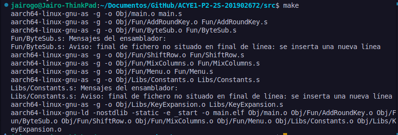
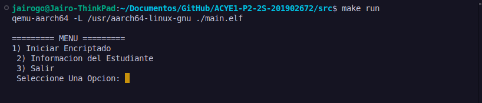
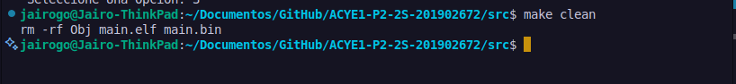
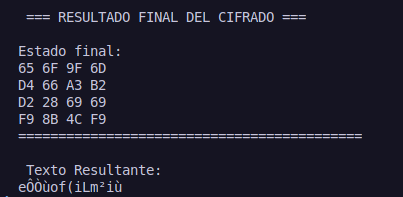
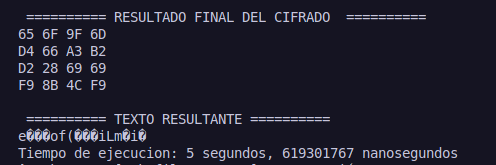

# 📘 **Manual Técnico: Algoritmo de encriptación AES-128 – 2S2025**  

#### Universidad San Carlos de Guatemala  
#### Facultad de Ingeniería  
#### Arquitectura de Computadores y Ensambladores 1  
#### Escuela de Ciencias y Sistemas  

## Proyecto #2: Implementación de AES-128 en ARM64  

#### Jairo Adelso Gómez Hernández  
#### 201902672  
#### Guatemala, Octubre 2025  

---

## 📖 1. Introducción
Este documento detalla el diseño técnico e implementación de **AES-128** en **lenguaje ensamblador ARM64**, con énfasis en la manipulación de memoria, registros y estructuras de datos de bajo nivel.  

El objetivo es comprender cómo se ejecutan los pasos del algoritmo **Rijndael (AES-128)** en una arquitectura RISC, replicando su funcionamiento matemático sin librerías externas.  

---

## 🖥️ 2. Arquitectura del Sistema
El sistema es un **programa monolítico** en ARM64 ensamblador que sigue la secuencia de funciones del algoritmo AES-128:  

1. Entrada del **texto plano** (16 bytes).  
2. Entrada de la **clave en hexadecimal** (128 bits).  
3. Ejecución de **KeyExpansion** para generar 11 subclaves.  
4. Ejecución de **10 rondas de AES**, cada una con las transformaciones:  
   - SubBytes  
   - ShiftRows  
   - MixColumns  
   - AddRoundKey  
5. Impresión de los estados intermedios y resultado final.  


---

## 📂 Estructura del Proyecto

📄 main.s # Programa principal (flujo AES + I/O)

📁 Fun/
│ ├── 📄 AddRoundKey.s # XOR estado con subclave
│ ├── 📄 ByteSub.s # Sustitución S-Box
│ ├── 📄 ShiftRow.s # Rotación de filas
│ ├── 📄 MixColumns.s # Mezcla de columnas
│ ├── 📄 Menu.s # Menú del Proyecto

📁 Libs/
│ ├── 📄 Constants.s # Tablas S-Box, Rcon, MixColumn Matrix
│ ├── 📄 KeyExpansion.s # Generación de subclaves

📁 Obj/
│ 📁 Fun/
│ │ ├── 🧩 AddRound.o
│ │ ├── 🧩 ByteSub.o
│ │ ├── 🧩 Menu.o
│ │ ├── 🧩 MixColumns.o
│ │ ├── 🧩 ShiftRow.o
│ 📁 Libs/
│ │ ├── 🧩 Constants.o
│ │ ├── 🧩 KeyExpansion.o

📁 Test/
│ ├── 📄 aes128.js # Programa Test en JS

---
## 🗂️ 4. Gestión de Memoria y Buffers
El programa reserva memoria en `.bss` para:  
- `matState`: matriz de estado (16 bytes en column-major).  
- `key`: clave activa (16 bytes).  
- `roundKeys`: subclaves (176 bytes, 11 × 16).  
- Buffers auxiliares (`buffer`, `temp_buffer`).  

📌 Ejemplo (sección `.bss` en `main.s`):  
```asm
    .section .bss
    .align 4
    .global matState
matState:               .space 16, 0     // Estado AES

    .global key
key:                    .space 16, 0     // Clave activa 128-bit (column-major)

buffer:                 .space 256, 0
temp_buffer:            .space 64, 0

// ---- TimeSpec----
ts_start:               .space 16, 0
ts_end:                 .space 16, 0

// Buffer para imprimir enteros decimales
decbuf:                 .space 32, 0
```

---

## 📑 5. Funciones Clave del Algoritmo AES-128

### 5.1 KeyExpansion
Genera las 10 subclaves adicionales a partir de la clave ingresada.  
 

```asm
// ======================= KeyExpansion ========================
    .section .bss
    .align 4
    .global roundKeys
roundKeys:
    .space 16 * 11, 0      // 176 bytes: subclaves 0 a 10

    .section .text
    .align 2
    .global keyExpansion
    .type   keyExpansion, %function

    .extern key
    .extern Sbox
    .extern Rcon

keyExpansion:
    stp x29, x30, [sp, #-64]!
    mov x29, sp
    stp x19, x20, [sp, #16]
    stp x21, x22, [sp, #32]
    stp x23, x24, [sp, #48]

    // Punteros base
    ldr x5, =roundKeys
    ldr x1, =key
    ldr x6, =Sbox
    ldr x7, =Rcon

    // -------- Subclave 0: copia directa de key (16 bytes) --------
    mov x2, #16
1:  cbz x2, 2f
    ldrb w0, [x1], #1
    strb w0, [x5], #1
    sub  x2, x2, #1
    b    1b
2:
    // x5 queda al final de subclave 0; para calculos, mejor conservar base:
    ldr x5, =roundKeys

    // i = 4 .. 43  (palabras de 4 bytes)
    mov x3, #4

// =============== Bucle de expansion de claves =================
keyexp_loop:
    cmp x3, #44
    b.ge keyexp_done

    // Direcciones de palabras: W[i], W[i-1], W[i-4]
    // Cada palabra ocupa 4 bytes contiguos
    mov x8, x3
    lsl x8, x8, #2            // x8 = i*4
    add x8, x5, x8            // x8 = &W[i][0]

    sub x9, x3, #1
    lsl x9, x9, #2
    add x9, x5, x9            // x9 = &W[i-1][0]

    sub x10, x3, #4
    lsl x10, x10, #2
    add x10, x5, x10          // x10 = &W[i-4][0]

    // temp = W[i-1]
    ldrb w20, [x9]            // temp[0]
    ldrb w21, [x9, #1]        // temp[1]
    ldrb w22, [x9, #2]        // temp[2]
    ldrb w23, [x9, #3]        // temp[3]

    // if (i % 4 == 0) temp = g(temp)
    // RotWord: (b0,b1,b2,b3) -> (b1,b2,b3,b0)
    and x4, x3, #3
    cbnz x4, 5f

    // RotWord
    mov w19, w20              // save b0
    mov w20, w21              // b1
    mov w21, w22              // b2
    mov w22, w23              // b3
    mov w23, w19              // b0

    // SubWord (Sbox)
    // w20 = Sbox[w20], etc.
    // addr = Sbox + byte
    uxtw x0, w20
    add  x0, x6, x0
    ldrb w20, [x0]

    uxtw x0, w21
    add  x0, x6, x0
    ldrb w21, [x0]

    uxtw x0, w22
    add  x0, x6, x0
    ldrb w22, [x0]

    uxtw x0, w23
    add  x0, x6, x0
    ldrb w23, [x0]

    // Rcon: índice = (i/4) - 1, y sólo se XOR al primer byte
    lsr x0, x3, #2            // x0 = i/4
    sub x0, x0, #1            // x0 = (i/4) - 1  en [0 a 9]
    lsl x0, x0, #2            // Rcon está con 4 bytes por fila
    add x0, x7, x0
    ldrb w1, [x0]             // Rcon[ idx ][0]
    eor  w20, w20, w1         // temp[0] XOR Rcon
5:
    // W[i] = W[i-4] XOR temp (byte a byte)
    ldrb w24, [x10]           // wprev[0]
    ldrb w25, [x10, #1]
    ldrb w26, [x10, #2]
    ldrb w27, [x10, #3]

    eor  w24, w24, w20
    eor  w25, w25, w21
    eor  w26, w26, w22
    eor  w27, w27, w23

    strb w24, [x8]
    strb w25, [x8, #1]
    strb w26, [x8, #2]
    strb w27, [x8, #3]

    add x3, x3, #1
    b   keyexp_loop

// ================= Final de expansion =================
keyexp_done:
    ldp x23, x24, [sp, #48]
    ldp x21, x22, [sp, #32]
    ldp x19, x20, [sp, #16]
    ldp x29, x30, [sp], #64
    ret

    .size keyExpansion, (. - keyExpansion)

```

---

### 5.2 AddRoundKey
Realiza XOR entre la matriz de estado y la subclave actual.  

```asm
// ======================= AddRoundKey (parametrizado) =======================
    .text
    .global addRoundKey
    .type   addRoundKey, %function
    .extern matState

// Uso:
//   x0 = &matState (opcional, se puede ignorar porque es global)
//   x1 = &subclave de 16 bytes dentro de roundKeys
addRoundKey:
    // Prólogo
    stp x29, x30, [sp, #-32]!
    mov x29, sp
    stp x19, x20, [sp, #16]

    ldr x19, =matState     // puntero al estado
    mov x20, x1            // puntero a la subclave
    mov x0, #0
1:  cmp x0, #16
    b.ge 2f
    ldrb w1, [x19, x0]
    ldrb w2, [x20, x0]
    eor  w3, w1, w2
    strb w3, [x19, x0]
    add x0, x0, #1
    b    1b

2:  // Epílogo
    ldp x19, x20, [sp, #16]
    ldp x29, x30, [sp], #32
    ret

    .size addRoundKey, (. - addRoundKey)

```

---

### 5.3 SubBytes
Sustitución no lineal mediante la tabla `Sbox`.  

```asm
// ======================= ByteSub ========================


    .text
    .global subBytes
    .type   subBytes, %function
    .extern matState
    .extern Sbox

subBytes:
    // Prólogo
    stp x29, x30, [sp, #-32]!
    mov x29, sp
    stp x19, x20, [sp, #16]

    ldr x19, =matState
    ldr x20, =Sbox
    mov x0, #0
1:  cmp x0, #16
    b.ge 2f
    ldrb w1, [x19, x0]     // byte actual
    uxtw x1, w1            // índice 0..255
    ldrb w2, [x20, x1]     // Sbox[byte]
    strb w2, [x19, x0]
    add x0, x0, #1
    b 1b

2:  // Epílogo
    ldp x19, x20, [sp, #16]
    ldp x29, x30, [sp], #32
    ret

    .size subBytes, (. - subBytes)

```
---

### 5.4 ShiftRows
Rotación de las filas de la matriz.  
```
// ======================= ShiftRow ========================

    .text
    .global shiftRows
    .type   shiftRows, %function
    .extern matState

shiftRows:
    // Prólogo
    stp x29, x30, [sp, #-32]!
    mov x29, sp
    stp x19, x20, [sp, #16]

    // x19 = &matState
    ldr x19, =matState

    // Recorre filas 0..3
    mov x0, #0                    // x0 = fila (r)
1:
    cmp x0, #4
    b.ge 9f

    // Direcciones de la fila r en column-major:
    // addr0 = base + (r + 0*4), addr1 = base + (r + 1*4), ...
    add x9,  x19, x0              // addr0 = base + r
    add x10, x9,  #4              // addr1 = base + r + 4
    add x11, x9,  #8              // addr2 = base + r + 8
    add x12, x9,  #12             // addr3 = base + r + 12

    // Cargar los 4 bytes de la fila (b0, b1, b2, b3)
    ldrb w3, [x9]                 // b0 = state[r + 0*4]
    ldrb w4, [x10]                // b1 = state[r + 1*4]
    ldrb w5, [x11]                // b2 = state[r + 2*4]
    ldrb w6, [x12]                // b3 = state[r + 3*4]

    // Selección según nº de rotaciones = fila (r)
    cbz x0, 2f                    // fila 0 -> sin cambios
    cmp x0, #1
    beq 3f                        // fila 1 -> left 1
    cmp x0, #2
    beq 4f                        // fila 2 -> left 2
    // fila 3 -> left 3
5:
    // left 3: [b3, b0, b1, b2]
    strb w6, [x9]
    strb w3, [x10]
    strb w4, [x11]
    strb w5, [x12]
    b   8f

2:
    // Fila 0: no hacer nada  [b0, b1, b2, b3]
    strb w3, [x9]
    strb w4, [x10]
    strb w5, [x11]
    strb w6, [x12]
    b   8f

3:
    // Fila 1: left 1 -> [b1, b2, b3, b0]
    strb w4, [x9]
    strb w5, [x10]
    strb w6, [x11]
    strb w3, [x12]
    b   8f

4:
    // Fila 2: left 2 -> [b2, b3, b0, b1]
    strb w5, [x9]
    strb w6, [x10]
    strb w3, [x11]
    strb w4, [x12]
    b   8f

8:
    add x0, x0, #1
    b   1b

9:
    // Epílogo
    ldp x19, x20, [sp, #16]
    ldp x29, x30, [sp], #32
    ret

    .size shiftRows, (. - shiftRows)


```

---

### 5.5 MixColumns
Multiplicación de cada columna en el campo de Galois GF(2^8).  

```
// ======================= MixColumns =======================

    .text
    .global mixColumns
    .global MixColumns
    .type   mixColumns, %function

    .extern matState
    .extern MixColMat

mixColumns:
MixColumns:
    // Prólogo: preservar callee-saved
    stp x29, x30, [sp, #-64]!
    mov x29, sp
    stp x19, x20, [sp, #16]
    stp x21, x22, [sp, #32]
    stp x23, x24, [sp, #48]

    // Bases
    ldr x19, =matState
    ldr x20, =MixColMat

    // col = 0..3
    mov x21, #0

col_loop:
    cmp x21, #4
    b.ge end_mc

    // base de la columna
    lsl  x22, x21, #2              // col*4
    add  x23, x19, x22             // x23 = &state[col*4]

    // a0..a3
    ldrb w4, [x23, #0]             // a0
    ldrb w5, [x23, #1]             // a1
    ldrb w6, [x23, #2]             // a2
    ldrb w7, [x23, #3]             // a3

    // ---- Precalcular t2_i y t3_i ----

    // t2_0
    and  w16, w4, #0x80
    lsl  w8,  w4, #1
    and  w8,  w8, #0xFF
    cbz  w16, 1f
    mov  w17, #0x1B
    eor  w8,  w8, w17
1:
    eor  w12, w8,  w4             // t3_0

    // t2_1
    and  w16, w5, #0x80
    lsl  w9,  w5, #1
    and  w9,  w9, #0xFF
    cbz  w16, 2f
    mov  w17, #0x1B
    eor  w9,  w9, w17
2:
    eor  w13, w9,  w5             // t3_1

    // t2_2
    and  w16, w6, #0x80
    lsl  w10, w6, #1
    and  w10, w10, #0xFF
    cbz  w16, 3f
    mov  w17, #0x1B
    eor  w10, w10, w17
3:
    eor  w14, w10, w6             // t3_2

    // t2_3
    and  w16, w7, #0x80
    lsl  w11, w7, #1
    and  w11, w11, #0xFF
    cbz  w16, 4f
    mov  w17, #0x1B
    eor  w11, w11, w17
4:
    eor  w15, w11, w7             // t3_3

    // ---- fila r = 0 (MixColMat[0..3]) ----
    ldrb w0, [x20, #0]            // c0
    ldrb w1, [x20, #1]            // c1
    ldrb w2, [x20, #2]            // c2
    ldrb w3, [x20, #3]            // c3

    // sel(c0, a0)
    cmp  w0, #1
    b.eq  10f
    cmp  w0, #2
    b.eq  11f
    mov  w18, w12                 // 3*a0
    b     12f
10: mov  w18, w4                  // 1*a0
    b     12f
11: mov  w18, w8                  // 2*a0
12:
    // sel(c1, a1)
    cmp  w1, #1
    b.eq  13f
    cmp  w1, #2
    b.eq  14f
    eor  w18, w18, w13            // ^(3*a1)
    b     15f
13: eor  w18, w18, w5             // ^(1*a1)
    b     15f
14: eor  w18, w18, w9             // ^(2*a1)
15:
    // sel(c2, a2)
    cmp  w2, #1
    b.eq  16f
    cmp  w2, #2
    b.eq  17f
    eor  w18, w18, w14            // ^(3*a2)
    b     18f
16: eor  w18, w18, w6             // ^(1*a2)
    b     18f
17: eor  w18, w18, w10            // ^(2*a2)
18:
    // sel(c3, a3)
    cmp  w3, #1
    b.eq  19f
    cmp  w3, #2
    b.eq  20f
    eor  w18, w18, w15            // ^(3*a3)
    b     21f
19: eor  w18, w18, w7             // ^(1*a3)
    b     21f
20: eor  w18, w18, w11            // ^(2*a3)
21:
    strb w18, [x23, #0]

    // ---- fila r = 1 (offset +4) ----
    ldrb w0, [x20, #4]
    ldrb w1, [x20, #5]
    ldrb w2, [x20, #6]
    ldrb w3, [x20, #7]

    // repetir selección/acumulación
    cmp  w0, #1 ; b.eq 22f
    cmp  w0, #2 ; b.eq 23f
    mov  w18, w12 ; b 24f
22: mov  w18, w4  ; b 24f
23: mov  w18, w8
24:
    cmp  w1, #1 ; b.eq 25f
    cmp  w1, #2 ; b.eq 26f
    eor  w18, w18, w13 ; b 27f
25: eor  w18, w18, w5  ; b 27f
26: eor  w18, w18, w9
27:
    cmp  w2, #1 ; b.eq 28f
    cmp  w2, #2 ; b.eq 29f
    eor  w18, w18, w14 ; b 30f
28: eor  w18, w18, w6  ; b 30f
29: eor  w18, w18, w10
30:
    cmp  w3, #1 ; b.eq 31f
    cmp  w3, #2 ; b.eq 32f
    eor  w18, w18, w15 ; b 33f
31: eor  w18, w18, w7  ; b 33f
32: eor  w18, w18, w11
33:
    strb w18, [x23, #1]

    // ---- fila r = 2 (offset +8) ----
    ldrb w0, [x20, #8]
    ldrb w1, [x20, #9]
    ldrb w2, [x20, #10]
    ldrb w3, [x20, #11]

    cmp  w0, #1 ; b.eq 34f
    cmp  w0, #2 ; b.eq 35f
    mov  w18, w12 ; b 36f
34: mov  w18, w4  ; b 36f
35: mov  w18, w8
36:
    cmp  w1, #1 ; b.eq 37f
    cmp  w1, #2 ; b.eq 38f
    eor  w18, w18, w13 ; b 39f
37: eor  w18, w18, w5  ; b 39f
38: eor  w18, w18, w9
39:
    cmp  w2, #1 ; b.eq 40f
    cmp  w2, #2 ; b.eq 41f
    eor  w18, w18, w14 ; b 42f
40: eor  w18, w18, w6  ; b 42f
41: eor  w18, w18, w10
42:
    cmp  w3, #1 ; b.eq 43f
    cmp  w3, #2 ; b.eq 44f
    eor  w18, w18, w15 ; b 45f
43: eor  w18, w18, w7  ; b 45f
44: eor  w18, w18, w11
45:
    strb w18, [x23, #2]

    // ---- fila r = 3 (offset +12) ----
    ldrb w0, [x20, #12]
    ldrb w1, [x20, #13]
    ldrb w2, [x20, #14]
    ldrb w3, [x20, #15]

    cmp  w0, #1 ; b.eq 46f
    cmp  w0, #2 ; b.eq 47f
    mov  w18, w12 ; b 48f
46: mov  w18, w4  ; b 48f
47: mov  w18, w8
48:
    cmp  w1, #1 ; b.eq 49f
    cmp  w1, #2 ; b.eq 50f
    eor  w18, w18, w13 ; b 51f
49: eor  w18, w18, w5  ; b 51f
50: eor  w18, w18, w9
51:
    cmp  w2, #1 ; b.eq 52f
    cmp  w2, #2 ; b.eq 53f
    eor  w18, w18, w14 ; b 54f
52: eor  w18, w18, w6  ; b 54f
53: eor  w18, w18, w10
54:
    cmp  w3, #1 ; b.eq 55f
    cmp  w3, #2 ; b.eq 56f
    eor  w18, w18, w15 ; b 57f
55: eor  w18, w18, w7  ; b 57f
56: eor  w18, w18, w11
57:
    strb w18, [x23, #3]

    // siguiente columna
    add  x21, x21, #1
    b    col_loop

end_mc:
    // Epílogo: restaurar call-saved
    ldp x23, x24, [sp, #48]
    ldp x21, x22, [sp, #32]
    ldp x19, x20, [sp, #16]
    ldp x29, x30, [sp], #64
    ret

    .size mixColumns, (. - mixColumns)


```

---

## 🛠️ 6. Compilación y Ejecución
### 6.1 Compilar
```bash
make
```




### 6.2 Ejecutar
```bash
make run
```


### 6.3 Limpiar objetos
```bash
make clean
```

---

## 📋 7. Validación y Pruebas
---
- Comparar resultados con una implementación en alto nivel (`aes128.js` en `Test`).  
- Verificar matrices intermedias en cada ronda.  
- Probar con clave Texto
 (`si sale arqui 1`)
- Probar con Clave Hexa
 (`FFFFFFFFFFFFFFFFFFFFFFFFFFFFFFFF`).  
---
---
- **Test En AES128.JS**


---
- **Test En ARM64**


---

## 📖 8. Conclusiones
El proyecto permitió:  
- Comprender la manipulación de bytes en ARM64.  
- Implementar operaciones de álgebra en campos de Galois a bajo nivel.  
- Validar que el flujo del algoritmo AES-128 es reproducible en ensamblador.  

---

## ✒️ Autor
- **Jairo Adelso Gómez Hernández**  
- **201902672**  
- **ACYE1 2S2025**  

---