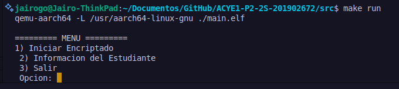
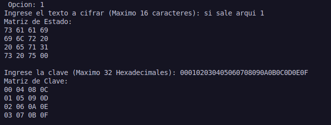
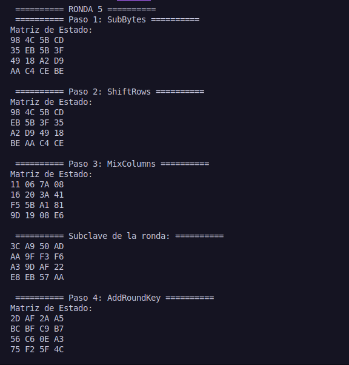
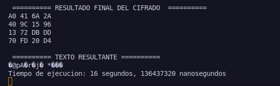
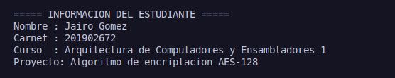

# 📘 Manual de Usuario  
### **Algoritmo de encriptación AES-128 – 2S2025**  

#### Universidad San Carlos de Guatemala  
#### Facultad de Ingeniería  
#### Arquitectura de Computadores y Ensambladores 1  
#### Escuela de Ciencias y Sistemas  

---

## Proyecto #2: Implementación de AES-128 en ARM64  
#### Guatemala, Octubre 2025
#### Segundo Semestre 2025

---

## 📑 Índice
1. [Introducción](#introducción)  
2. [Requisitos](#requisitos)  
3. [Estructura del Proyecto](#estructura-del-proyecto)  
4. [Interfaz de Usuario](#interfaz-de-usuario)  
5. [Funciones Implementadas](#funciones-implementadas)  
6. [Compilación y Ejecución](#compilación-y-ejecución)  
7. [Ejemplos de Uso](#ejemplos-de-uso)  
8. [Capturas de Consola](#capturas-de-consola)  
9. [Autores](#autores)  

---

## 📖 Introducción
Este proyecto implementa el algoritmo de **encriptación simétrica AES-128** en **ensamblador ARM64**, siguiendo la estructura de rondas estándar:  

- **AddRoundKey**  
- **SubBytes**  
- **ShiftRows**  
- **MixColumns**  
- **KeyExpansion**  

El programa toma como entrada un **texto de 16 caracteres (128 bits)** y una **clave en formato hexadecimal (128 bits)**, genera las **subclaves por ronda**, y ejecuta las **10 rondas de AES-128**, mostrando resultados intermedios y el texto cifrado final.  

---

## ⚙️ Requisitos
- **Sistema operativo Linux (Ubuntu recomendado)**  
- **Herramientas ARM64** instaladas:  
  - `aarch64-linux-gnu-as` (assembler)  
  - `aarch64-linux-gnu-ld` (linker)  
  - `qemu-aarch64` (emulador)  
- **gdb-multiarch** (para depuración opcional)  
- Git (para clonar y versionar el proyecto)  

---

## 📂 Estructura del Proyecto

📄 main.s # Programa principal (flujo AES + I/O)
📁 Fun/
│ ├── 📄 AddRoundKey.s # XOR estado con subclave
│ ├── 📄 ByteSub.s # Sustitución S-Box
│ ├── 📄 ShiftRow.s # Rotación de filas
│ ├── 📄 MixColumns.s # Mezcla de columnas
│ ├── 📄 Menu.s # Menú del Proyecto

📁 Libs/
│ ├── 📄 Constants.s # Tablas S-Box, Rcon, MixColumn Matrix
│ ├── 📄 KeyExpansion.s # Generación de subclaves

📁 Obj/
│ 📁 Fun/
│ │ ├── 🧩 AddRound.o
│ │ ├── 🧩 ByteSub.o
│ │ ├── 🧩 Menu.o
│ │ ├── 🧩 MixColumns.o
│ │ ├── 🧩 ShiftRow.o
│ 📁 Libs/
│ │ ├── 🧩 Constants.o
│ │ ├── 🧩 KeyExpansion.o

📁 Test/
│ ├── 📄 aes128.js # Programa Test en JS

---

## 🖥️ Interfaz de Usuario
La interfaz es **consola interactiva**. El flujo de ejecución es:  
1. Solicita **texto de entrada** (máx. 16 caracteres).  
2. Muestra la **matriz de estado inicial**.  
3. Solicita la **clave en hexadecimal** (máx. 32 dígitos hex).  
4. Muestra la **matriz de clave inicial**.  
5. Ejecuta las **10 rondas de AES-128**, mostrando cada transformación.  
6. Imprime el **resultado final en hexadecimal** y en **ASCII**.  

*(Aquí se puede insertar una imagen de la interfaz de consola mostrando el menú y flujo de ejecución)*

---

## 🛠️ Funciones Implementadas
- **AddRoundKey**: XOR entre la matriz de estado y la subclaves.  
- **SubBytes**: Sustitución no lineal mediante S-Box.  
- **ShiftRows**: Rotación de las filas de la matriz.  
- **MixColumns**: Mezcla de bytes por columna con operaciones en GF(2^8).  
- **KeyExpansion**: Generación de subclaves a partir de la clave ingresada.  

*(Aquí se pueden insertar diagramas explicativos de cada función para mayor comprensión)*

---

## 🧩 Compilación y Ejecución
1. Clonar el repositorio:  
   ```bash
   git clone <url_del_repo>
   cd Proyecto_AES128
   ```
2. Compilar con make:  
   ```bash
   make
   ```
3. Ejecutar en QEMU:  
   ```bash
   make run
   ```
4. Para Limpiar Objetos:  
   ```bash
   make clean
   ```

*(Aquí se puede insertar una captura de consola mostrando la compilación y ejecución exitosa)*

---

## 📋 Ejemplos de Uso
### Entrada:
```
Ingrese el texto a cifrar (Maximo 16 caracteres): hola1234hola1234
Ingrese la clave (Maximo 32 Hexadecimales): FFFFFFFFFFFFFFFFFFFFFFFFFFFFFFFF
```

### Salida (fragmento):
```
Matriz de Estado:
68 6F 6C 61 
31 32 33 34 
68 6F 6C 61 
31 32 33 34 

Matriz de Clave:
FF FF FF FF 
FF FF FF FF 
FF FF FF FF 
FF FF FF FF 

========== RONDA 1 ==========
--- Paso 1: SubBytes ---
...
========== RESULTADO FINAL DEL CIFRADO ==========
C5 A7 8F 3D  ...
========== TEXTO RESULTANTE ==========
ÿÿÿÿ....
```

*(Aquí se puede insertar una imagen comparando la entrada, clave y el resultado final en consola)*

---

## 🖼️ Capturas de Consola

### _Menu_
  

### _Ejemplo: Entrada y clave_
  

### _Ejemplo: Ronda intermedia_
  

### _Ejemplo: Resultado final_
  

### _Informacion del Estudiante_
  

---

## ✒️ Autores
- **Jairo Adelso Gómez Hernández**  
- **201902672**  
- **ACYE1 2S2025**  

